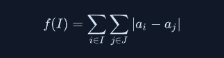

https://www.hackerrank.com/challenges/fair-cut/problem

# Fair Cut

Li and Lu have n integers, a1,a2,a3,a4,a5,a6,... , that they want to divide fairly between the two of them. They decide that if Li gets integers with indices I={i1,i1,i3,i4,i5...} (which implies that Lu gets integers with indices J={1,...n}\I ), then the measure of unfairness of this division is:

Sample Input 

4 2
4 3 1 2

Sample Output 

6

Explanation 0
One possible solution for this input is I={2,4};J={1,3}

|a2-a1|+|a2-a3|+|a4-a1|+|a4-a3|=1+2+2+1=6